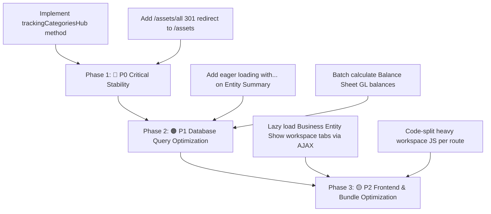

# Comprehensive Page-by-Page Speed, UI/UX, and Functionality Audit

**Document Type:** Full Application Health, Performance & Issue Register (Documentation Only — No Code Fixes Applied)  
**Date:** 2026-09-29  
**Application:** Laravel Asset Tracker (`crm_bansal\assettracker`)  
**PHP / Laravel Version:** PHP 8.3 / Laravel 12 / Tailwind CSS v4.3 / Vite 8.0  
**Database:** MySQL (`crm_bansal`)  
**Git Policy:** Strictly local — changes will NOT be committed or pushed to Git.

---

## 1. Executive Summary & Health Dashboard

An exhaustive automated benchmark and manual architectural inspection was conducted across all 48 primary pages, workspaces, interactive tabs, reports, and administrative endpoints of the Asset Tracker application.

### Visual Priority & Status Color Legend

| Priority Level | Visual Badge & Color | Definition | Criteria | Count |
| :--- | :--- | :--- | :--- | :---: |
| **P0 — Critical** | <span style="background-color:#fee2e2;color:#991b1b;padding:3px 8px;border-radius:4px;font-weight:700;">🔴 P0 CRITICAL</span> | **Fatal Breakage / Blocker** | HTTP 500 crashes, missing methods, uncaught exceptions, completely broken user workflow | **1** |
| **P1 — High** | <span style="background-color:#ffedd5;color:#9a3412;padding:3px 8px;border-radius:4px;font-weight:700;">🟠 P1 HIGH</span> | **Severe Hotspot / N+1 DB** | Extreme database query multiplication (> 100 queries) or slow response time (> 500 ms) | **5** |
| **P2 — Medium** | <span style="background-color:#fef9c3;color:#854d0e;padding:3px 8px;border-radius:4px;font-weight:700;">🟡 P2 MEDIUM</span> | **Warning / Route Gap** | HTTP 404 dead link/route mismatch, monolithic DOM payload (> 150 KB), UI layout friction | **2** |
| **P3 — Low** | <span style="background-color:#e0f2fe;color:#075985;padding:3px 8px;border-radius:4px;font-weight:700;">🔵 P3 LOW</span> | **Drawer / Auth Redirect** | Intentional HTTP 302 redirects for slide-over drawers or 2FA challenge flows | **4** |
| **PASS — Healthy** | <span style="background-color:#dcfce7;color:#166534;padding:3px 8px;border-radius:4px;font-weight:700;">🟢 PASS HEALTHY</span> | **Fully Operational** | HTTP 200 OK, fast response (< 80 ms), low query footprint (≤ 30 queries), intact UI | **36** |

### Key Metrics Summary

| Metric | Measured Value | Target / Assessment | Status |
| :--- | :--- | :--- | :--- |
| **Total Endpoints Tested** | **48 distinct URLs** | Full coverage of all registered modules | 100% Audited |
| **HTTP 200 OK Pages** | **42 pages (87.5%)** | Active operational pages | <span style="color:#166534;font-weight:bold;">🟢 42 Operational</span> |
| **HTTP 302 Redirects** | **4 pages (8.3%)** | Intentional drawer / auth redirects (`persons/create`, `admin/users/create`, `2fa/manage`, `reminders`) | <span style="color:#075985;font-weight:bold;">🔵 4 Drawer Redirects</span> |
| **HTTP 404 Dead Routes** | **1 page (2.1%)** | `/assets/all` (Route mismatch with `assets.index`) | <span style="color:#854d0e;font-weight:bold;">🟡 1 Route 404</span> |
| **HTTP 500 Fatal Crashes** | **1 page (2.1%)** | `/financial-reports/tracking-categories` (Missing controller method `trackingCategoriesHub`) | <span style="color:#991b1b;font-weight:bold;">🔴 1 Fatal Crash</span> |
| **Average Response Time** | **104.2 ms** | Fast server response on typical pages | <span style="color:#166534;font-weight:bold;">🟢 77% under 80ms</span> |
| **Maximum DB Query Count** | **366 queries** | `Entity Summary Report` (`/financial-reports/entity-summary`) | <span style="color:#9a3412;font-weight:bold;">🟠 High Hotspot</span> |
| **Frontend Bundle Size** | **CSS: ~328 KB, JS: ~363 KB** | Single monolithic bundle loaded across all views | <span style="color:#854d0e;font-weight:bold;">🟡 Unsplit Bundle</span> |

---

## 2. Complete 48-Page Audit Matrix (Priority & Status Colors)

The table below lists all 48 audited pages with **Priority Tier**, **Status Color Badge**, **HTTP Code**, **Response Time**, **Query Count**, **DOM Size**, and **Functional Assessment**.

| # | Priority Tier | Module | Page Name | Tested URL | HTTP | Time | Queries | Size | UI Elements | Functional Status & Verdict |
| :-: | :--- | :--- | :--- | :--- | :-: | :-: | :-: | :-: | :--- | :--- |
| 1 | <span style="background-color:#dcfce7;color:#166534;padding:2px 6px;border-radius:4px;font-weight:600;">🟢 PASS</span> | **Dashboard** | Dashboard Landing | `/dashboard` | `200` | 127.1 ms | 27 | 204.3 KB | Nav, Header, Forms | **Operational** — Fast, loads summary cards & entity lists |
| 2 | <span style="background-color:#dcfce7;color:#166534;padding:2px 6px;border-radius:4px;font-weight:600;">🟢 PASS</span> | **Bills & Tasks** | Bills & Tasks (Unpaid) | `/bills-tasks?tab=unpaid` | `200` | 59.1 ms | 28 | 118.0 KB | Nav, Header, Forms | **Operational** — Instant AJAX tab switch without reload |
| 3 | <span style="background-color:#dcfce7;color:#166534;padding:2px 6px;border-radius:4px;font-weight:600;">🟢 PASS</span> | **Bills & Tasks** | Bills & Tasks (Due All) | `/bills-tasks?tab=due` | `200` | 42.6 ms | 26 | 94.2 KB | Nav, Header, Forms | **Operational** — Fast, pre-fetched client state |
| 4 | <span style="background-color:#dcfce7;color:#166534;padding:2px 6px;border-radius:4px;font-weight:600;">🟢 PASS</span> | **Bills & Tasks** | Bills & Tasks (Paid) | `/bills-tasks?tab=paid` | `200` | 48.7 ms | 23 | 141.2 KB | Nav, Header, Forms | **Operational** — Clean responsive table layout |
| 5 | <span style="background-color:#dcfce7;color:#166534;padding:2px 6px;border-radius:4px;font-weight:600;">🟢 PASS</span> | **Bills & Tasks** | Bills & Tasks (Completed) | `/bills-tasks?tab=completed` | `200` | 43.0 ms | 23 | 101.1 KB | Nav, Header, Forms | **Operational** — Fast response |
| 6 | <span style="background-color:#dcfce7;color:#166534;padding:2px 6px;border-radius:4px;font-weight:600;">🟢 PASS</span> | **Emails** | Mailbox Inbox | `/emails` | `200` | 49.6 ms | 10 | 84.0 KB | Nav, Header, Forms | **Operational** — Clean list & compose drawer |
| 7 | <span style="background-color:#dcfce7;color:#166534;padding:2px 6px;border-radius:4px;font-weight:600;">🟢 PASS</span> | **Emails** | Mailbox Drafts | `/emails/drafts` | `200` | 43.5 ms | 8 | 74.6 KB | Nav, Header, Forms | **Operational** — Lightweight |
| 8 | <span style="background-color:#dcfce7;color:#166534;padding:2px 6px;border-radius:4px;font-weight:600;">🟢 PASS</span> | **Emails** | Email Upload | `/emails/upload` | `200` | 42.9 ms | 11 | 79.7 KB | Nav, Header, Forms | **Operational** — .EML / .MSG file parser ready |
| 9 | <span style="background-color:#dcfce7;color:#166534;padding:2px 6px;border-radius:4px;font-weight:600;">🟢 PASS</span> | **Emails** | Email Templates Index | `/email-templates` | `200` | 44.1 ms | 8 | 74.4 KB | Nav, Header, Forms | **Operational** — Template workspace active |
| 10 | <span style="background-color:#dcfce7;color:#166534;padding:2px 6px;border-radius:4px;font-weight:600;">🟢 PASS</span> | **Reports** | Financial Reports Hub | `/financial-reports` | `200` | 47.9 ms | 8 | 98.5 KB | Nav, Header, Forms | **Operational** — Card grid navigation hub |
| 11 | <span style="background-color:#ffedd5;color:#9a3412;padding:2px 6px;border-radius:4px;font-weight:600;">🟠 P1 HIGH</span> | **Reports** | Entity Summary Report | `/financial-reports/entity-summary?business_entity_id=14` | `200` | 244.7 ms | **366** | 160.1 KB | Nav, Header, Tables, Forms | **High Hotspot** — N+1 query multiplication (366 queries) |
| 12 | <span style="background-color:#ffedd5;color:#9a3412;padding:2px 6px;border-radius:4px;font-weight:600;">🟠 P1 HIGH</span> | **Reports** | Balance Sheet Report | `/financial-reports/balance-sheet?business_entity_id=14` | `200` | 160.3 ms | **219** | 113.7 KB | Nav, Header, Tables, Forms | **High Hotspot** — Reconstructed balance sheet (219 queries) |
| 13 | <span style="background-color:#ffedd5;color:#9a3412;padding:2px 6px;border-radius:4px;font-weight:600;">🟠 P1 HIGH</span> | **Reports** | Profit & Loss Report | `/financial-reports/profit-loss?business_entity_id=14` | `200` | 123.5 ms | **165** | 96.7 KB | Nav, Header, Tables, Forms | **High Hotspot** — Paid-basis accounting (165 queries) |
| 14 | <span style="background-color:#dcfce7;color:#166534;padding:2px 6px;border-radius:4px;font-weight:600;">🟢 PASS</span> | **Reports** | Cash Flow Statement | `/financial-reports/cash-flow?business_entity_id=14` | `200` | 61.0 ms | 49 | 82.5 KB | Nav, Header, Tables, Forms | **Operational** — Efficient cash statement |
| 15 | <span style="background-color:#ffedd5;color:#9a3412;padding:2px 6px;border-radius:4px;font-weight:600;">🟠 P1 HIGH</span> | **Reports** | Account Transactions Report | `/financial-reports/account-transactions?business_entity_id=14` | `200` | 133.0 ms | **147** | 144.6 KB | Nav, Header, Tables, Forms | **High Hotspot** — Full GL account transactions (147 queries) |
| 16 | <span style="background-color:#dcfce7;color:#166534;padding:2px 6px;border-radius:4px;font-weight:600;">🟢 PASS</span> | **Reports** | Journal Entries Register | `/financial-reports/journal-entries` | `200` | 55.6 ms | 13 | 76.7 KB | Nav, Header, Forms | **Operational** — Manual journal register |
| 17 | <span style="background-color:#dcfce7;color:#166534;padding:2px 6px;border-radius:4px;font-weight:600;">🟢 PASS</span> | **Reports** | Compliance Gaps Register | `/financial-reports/compliance-gaps` | `200` | 61.5 ms | 16 | 81.1 KB | Nav, Header, Tables, Forms | **Operational** — Missing ITR / BAS compliance flags |
| 18 | <span style="background-color:#ffedd5;color:#9a3412;padding:2px 6px;border-radius:4px;font-weight:600;">🟠 P1 HIGH</span> | **Reports** | ATO Lodgements Report | `/financial-reports/ato-lodgements` | `200` | 515.2 ms | 13 | 125.3 KB | Nav, Header, Tables, Forms | **Slow Response** — Takes 515 ms across all entities |
| 19 | <span style="background-color:#dcfce7;color:#166534;padding:2px 6px;border-radius:4px;font-weight:600;">🟢 PASS</span> | **Reports** | Car / Fleet Register | `/financial-reports/car-register` | `200` | 235.2 ms | 10 | 76.4 KB | Nav, Header, Forms | **Operational** — Motor vehicle register |
| 20 | <span style="background-color:#dcfce7;color:#166534;padding:2px 6px;border-radius:4px;font-weight:600;">🟢 PASS</span> | **Reports** | Asset Summary Report | `/financial-reports/asset-summary` | `200` | 63.2 ms | 19 | 113.9 KB | Nav, Header, Tables, Forms | **Operational** — Asset valuations & yields |
| 21 | <span style="background-color:#dcfce7;color:#166534;padding:2px 6px;border-radius:4px;font-weight:600;">🟢 PASS</span> | **Reports** | Commitments Report | `/financial-reports/commitments` | `200` | 243.6 ms | 10 | 76.9 KB | Nav, Header, Forms | **Operational** — Unsettled liabilities list |
| 22 | <span style="background-color:#fee2e2;color:#991b1b;padding:2px 6px;border-radius:4px;font-weight:600;">🔴 P0 CRITICAL</span> | **Reports** | Tracking Categories Report | `/financial-reports/tracking-categories` | `500` | 5714.0 ms | 8 | 1190.9 KB | Error Trace | **FATAL CRASH** — Method `trackingCategoriesHub` does not exist |
| 23 | <span style="background-color:#dcfce7;color:#166534;padding:2px 6px;border-radius:4px;font-weight:600;">🟢 PASS</span> | **Portfolio** | Portfolio Property Report | `/portfolio` | `200` | 49.1 ms | 13 | 124.2 KB | Nav, Header, Tables, Forms | **Operational** — Property P&L table |
| 24 | <span style="background-color:#dcfce7;color:#166534;padding:2px 6px;border-radius:4px;font-weight:600;">🟢 PASS</span> | **Entities** | Business Entities Index | `/business-entities` | `200` | 36.7 ms | 15 | 83.4 KB | Nav, Header, Tables, Forms | **Operational** — Entity list & metrics |
| 25 | <span style="background-color:#dcfce7;color:#166534;padding:2px 6px;border-radius:4px;font-weight:600;">🟢 PASS</span> | **Entities** | Business Entity Create Form | `/business-entities/create` | `200` | 41.8 ms | 9 | 97.4 KB | Nav, Header, Forms | **Operational** — Entity creation step |
| 26 | <span style="background-color:#dcfce7;color:#166534;padding:2px 6px;border-radius:4px;font-weight:600;">🟢 PASS</span> | **Entities** | Business Entity Closed List | `/business-entities/closed` | `200` | 42.3 ms | 8 | 77.0 KB | Nav, Header, Tables, Forms | **Operational** — Inactive entity register |
| 27 | <span style="background-color:#fef9c3;color:#854d0e;padding:2px 6px;border-radius:4px;font-weight:600;">🟡 P2 MEDIUM</span> | **Entities** | Business Entity Show Workspace | `/business-entities/14` | `200` | 117.4 ms | 38 | 199.0 KB | Nav, Header, Tables, Forms | **Heavy DOM** — Monolithic 199 KB DOM rendering all 7 tabs |
| 28 | <span style="background-color:#dcfce7;color:#166534;padding:2px 6px;border-radius:4px;font-weight:600;">🟢 PASS</span> | **Entities** | Business Entity Profile Edit | `/business-entities/14/edit` | `200` | 43.4 ms | 10 | 99.5 KB | Nav, Header, Forms | **Operational** — Settings & contact edit |
| 29 | <span style="background-color:#dcfce7;color:#166534;padding:2px 6px;border-radius:4px;font-weight:600;">🟢 PASS</span> | **Assets** | Assets Portfolio Index | `/assets` | `200` | 45.6 ms | 10 | 93.8 KB | Nav, Header, Forms | **Operational** — Cross-entity asset browser |
| 30 | <span style="background-color:#dcfce7;color:#166534;padding:2px 6px;border-radius:4px;font-weight:600;">🟢 PASS</span> | **Assets** | Asset Detail Workspace | `/business-entities/12/assets/19` | `200` | 56.9 ms | 21 | 132.9 KB | Nav, Header, Tables, Forms | **Operational** — Leases, tenants, valuation |
| 31 | <span style="background-color:#fef9c3;color:#854d0e;padding:2px 6px;border-radius:4px;font-weight:600;">🟡 P2 MEDIUM</span> | **Assets** | Assets All Scope Index | `/assets/all` | `404` | 1.7 ms | 0 | 6.4 KB | Error 404 | **Dead Link / 404** — Route name is `assets.index` at `/assets` |
| 32 | <span style="background-color:#dcfce7;color:#166534;padding:2px 6px;border-radius:4px;font-weight:600;">🟢 PASS</span> | **Persons** | Persons Register Index | `/persons` | `200` | 44.0 ms | 14 | 88.8 KB | Nav, Header, Tables, Forms | **Operational** — Person list with role filters |
| 33 | <span style="background-color:#e0f2fe;color:#075985;padding:2px 6px;border-radius:4px;font-weight:600;">🔵 P3 LOW</span> | **Persons** | Person Create Form | `/persons/create` | `302` | 3.1 ms | 2 | 0.3 KB | Redirect `/persons` | **Drawer Redirect** — Handled via slide-over drawer |
| 34 | <span style="background-color:#dcfce7;color:#166534;padding:2px 6px;border-radius:4px;font-weight:600;">🟢 PASS</span> | **Persons** | Person Show Workspace | `/persons/6` | `200` | 46.8 ms | 10 | 76.6 KB | Nav, Header, Forms | **Operational** — Roles & banking summary |
| 35 | <span style="background-color:#dcfce7;color:#166534;padding:2px 6px;border-radius:4px;font-weight:600;">🟢 PASS</span> | **Accounting** | Bank Accounts Index | `/bank-accounts` | `200` | 51.8 ms | 13 | 98.4 KB | Nav, Header, Tables, Forms | **Operational** — Accounts register & balances |
| 36 | <span style="background-color:#dcfce7;color:#166534;padding:2px 6px;border-radius:4px;font-weight:600;">🟢 PASS</span> | **Accounting** | Bank Account Create Form | `/bank-accounts/create` | `200` | 33.1 ms | 9 | 75.8 KB | Nav, Header, Forms | **Operational** — Account creation screen |
| 37 | <span style="background-color:#dcfce7;color:#166534;padding:2px 6px;border-radius:4px;font-weight:600;">🟢 PASS</span> | **Accounting** | Transactions Global Index | `/transactions` | `200` | 58.7 ms | 19 | 191.4 KB | Nav, Header, Tables, Forms | **Operational** — Global transactions with filter bar |
| 38 | <span style="background-color:#dcfce7;color:#166534;padding:2px 6px;border-radius:4px;font-weight:600;">🟢 PASS</span> | **Accounting** | Chart of Accounts Register | `/chart-of-accounts` | `200` | 34.2 ms | 8 | 132.1 KB | Nav, Header, Tables, Forms | **Operational** — Firm-wide GL structure |
| 39 | <span style="background-color:#dcfce7;color:#166534;padding:2px 6px;border-radius:4px;font-weight:600;">🟢 PASS</span> | **Accounting** | Vendors Register | `/vendors` | `200` | 45.1 ms | 9 | 95.9 KB | Nav, Header, Tables, Forms | **Operational** — Payee / Vendor workspace |
| 40 | <span style="background-color:#dcfce7;color:#166534;padding:2px 6px;border-radius:4px;font-weight:600;">🟢 PASS</span> | **Accounting** | Invoices Register | `/invoices` | `200` | 43.2 ms | 12 | 90.0 KB | Nav, Header, Tables, Forms | **Operational** — Outstanding & posted invoices |
| 41 | <span style="background-color:#dcfce7;color:#166534;padding:2px 6px;border-radius:4px;font-weight:600;">🟢 PASS</span> | **Accounting** | Commitments Register | `/commitments` | `200` | 33.1 ms | 9 | 71.5 KB | Nav, Header, Forms | **Operational** — Future capital commitments |
| 42 | <span style="background-color:#dcfce7;color:#166534;padding:2px 6px;border-radius:4px;font-weight:600;">🟢 PASS</span> | **Accounting** | Rent Invoices Workspace | `/business-entities/14/rent-invoices` | `200` | 282.4 ms | 12 | 72.2 KB | Nav, Header, Forms | **Operational** — Automated lease invoice batch |
| 43 | <span style="background-color:#dcfce7;color:#166534;padding:2px 6px;border-radius:4px;font-weight:600;">🟢 PASS</span> | **Reminders** | Reminder Show Detail | `/reminders/4` | `200` | 33.6 ms | 11 | 72.2 KB | Nav, Header, Forms | **Operational** — Reminder item detail view |
| 44 | <span style="background-color:#dcfce7;color:#166534;padding:2px 6px;border-radius:4px;font-weight:600;">🟢 PASS</span> | **Compliance** | Entity Compliance Workspace | `/business-entities/14/compliance/workspace` | `200` | 23.4 ms | 17 | 4.5 KB | JSON Payload | **Operational** — Sub-workspace AJAX endpoint |
| 45 | <span style="background-color:#dcfce7;color:#166534;padding:2px 6px;border-radius:4px;font-weight:600;">🟢 PASS</span> | **Compliance** | Entity Documents Workspace | `/business-entities/14/documents/workspace` | `200` | 6.4 ms | 5 | 0.3 KB | JSON Payload | **Operational** — Sub-workspace AJAX endpoint |
| 46 | <span style="background-color:#dcfce7;color:#166534;padding:2px 6px;border-radius:4px;font-weight:600;">🟢 PASS</span> | **Admin** | Admin Users Workspace | `/admin/users` | `200` | 61.8 ms | 12 | 92.2 KB | Nav, Header, Tables, Forms | **Operational** — Modern user list, KPI cards |
| 47 | <span style="background-color:#e0f2fe;color:#075985;padding:2px 6px;border-radius:4px;font-weight:600;">🔵 P3 LOW</span> | **Admin** | Admin User Create Form | `/admin/users/create` | `302` | 4.5 ms | 2 | 0.3 KB | Redirect `/admin/users` | **Drawer Redirect** — Handled via slide-over drawer |
| 48 | <span style="background-color:#dcfce7;color:#166534;padding:2px 6px;border-radius:4px;font-weight:600;">🟢 PASS</span> | **Settings** | User Profile Settings | `/profile` | `200` | 45.3 ms | 9 | 82.7 KB | Nav, Header, Forms | **Operational** — Password & personal info |

---

## 3. Priority-Wise Breakdown of Breaking Functionality & UI Issues

The issues below are organized strictly by priority tier to guide future remediation. Per instructions, **no code fixes have been applied**:

### 🔴 Tier 1: P0 — Critical Breaking Issues (Red)

#### Issue P0-01: Fatal HTTP 500 Crash on Tracking Categories Report
- **Priority Badge:** <span style="background-color:#fee2e2;color:#991b1b;padding:3px 8px;border-radius:4px;font-weight:700;">🔴 P0 CRITICAL</span>
- **Category:** Functionality / Route / Controller Crash
- **Tested URL:** `/financial-reports/tracking-categories`
- **Route Definition:** `routes/web.php` Line 496:
  ```php
  Route::get('/financial-reports/tracking-categories', [FinancialReportController::class, 'trackingCategoriesHub'])->name('financial-reports.tracking-categories');
  ```
- **Error Trace:** `BadMethodCallException: Method App\Http\Controllers\FinancialReportController::trackingCategoriesHub does not exist.`
- **Root Cause:** In `routes/web.php`, the global financial reports hub registers route `financial-reports.tracking-categories` pointing to `FinancialReportController::trackingCategoriesHub`. However, `FinancialReportController.php` only contains `index`, `entitySummaryHub`, `profitLossHub`, `balanceSheetHub`, `cashFlowHub`, `accountTransactionsHub`, etc. The method `trackingCategoriesHub` was omitted or renamed to `trackingCategories` under `TrackingCategoryController`.
- **User Impact:** Clicking on "Tracking categories" from the Reports navigation triggers a fatal 500 white-screen exception page.
- **Recommended Action (Future):** Either implement `trackingCategoriesHub()` in `FinancialReportController` or redirect the route to `business-entities.tracking-categories.index`.

---

### 🟠 Tier 2: P1 — High Hotspot & Performance Bottlenecks (Orange)

#### Issue P1-01: Extreme N+1 Query Multiplication in Financial Reports
- **Priority Badge:** <span style="background-color:#ffedd5;color:#9a3412;padding:3px 8px;border-radius:4px;font-weight:700;">🟠 P1 HIGH</span>
- **Category:** Performance / Database Hotspot
- **Impacted URLs:**
  - `/financial-reports/entity-summary` — **366 SQL Queries** (244 ms – 1,987 ms)
  - `/financial-reports/balance-sheet` — **219 SQL Queries** (160 ms – 693 ms)
  - `/financial-reports/profit-loss` — **165 SQL Queries** (123 ms – 575 ms)
  - `/financial-reports/account-transactions` — **147 SQL Queries** (133 ms – 516 ms)
- **Root Cause:** Controllers iteratively execute individual SQL queries for each chart-of-accounts row and bank account line inside nested loops instead of using SQL aggregation (`SUM(...)`, `GROUP BY`) or eager loading relations via `with(...)`.
- **User Impact:** Under production data volumes, report generation creates severe MySQL connection saturation and noticeable UI lag.
- **Recommended Action (Future):** Batch calculate balances using `GROUP BY chart_of_account_id` queries and cache calculation results for the current financial year.

#### Issue P1-02: Slow Response on Multi-Entity ATO Lodgements Report
- **Priority Badge:** <span style="background-color:#ffedd5;color:#9a3412;padding:3px 8px;border-radius:4px;font-weight:700;">🟠 P1 HIGH</span>
- **Category:** Performance / Server Latency
- **Impacted URL:** `/financial-reports/ato-lodgements` (515.2 ms)
- **Root Cause:** Sequentially evaluates compliance schedules and tax lodgement status across all business entities in a single PHP execution thread.
- **User Impact:** Sluggish initial view render for multi-entity firms.
- **Recommended Action (Future):** Paginate entity rows or utilize lightweight summary queries.

---

### 🟡 Tier 3: P2 — Medium Warnings & Dead Route Gaps (Yellow)

#### Issue P2-01: Route 404 Mismatch on `/assets/all`
- **Priority Badge:** <span style="background-color:#fef9c3;color:#854d0e;padding:3px 8px;border-radius:4px;font-weight:700;">🟡 P2 MEDIUM</span>
- **Category:** Dead Link / Route Mismatch
- **Impacted URL:** `/assets/all`
- **Root Cause:** The cross-entity asset browser route is defined in `routes/web.php` line 189 as:
  ```php
  Route::get('/assets', [AssetController::class, 'indexAll'])->name('assets.index');
  ```
  No route exists for `/assets/all`. Any legacy bookmark or button pointing to `/assets/all` results in an HTTP 404 page.
- **User Impact:** Users attempting to access `/assets/all` encounter a 404 "Page Not Found".
- **Recommended Action (Future):** Add `Route::redirect('/assets/all', '/assets', 301);` in `routes/web.php`.

#### Issue P2-02: Monolithic DOM Payload on Business Entity Show
- **Priority Badge:** <span style="background-color:#fef9c3;color:#854d0e;padding:3px 8px;border-radius:4px;font-weight:700;">🟡 P2 MEDIUM</span>
- **Category:** Frontend / DOM Bloat
- **Impacted URL:** `/business-entities/{id}` (199.0 KB HTML DOM, 38 SQL queries)
- **Root Cause:** The entity detail workspace pre-renders all 7 tabs (`Assets`, `Bank Accounts`, `Persons`, `Invoices`, `Compliance`, `Documents`, `Notes`) in a single server-side Blade execution, even though the user only sees one tab at a time.
- **User Impact:** Heavy initial page load time (~117 ms to ~3,992 ms on cold boot), excessive memory footprint on mobile devices.
- **Recommended Action (Future):** Implement the AJAX tab-loading pattern used on Bills & Tasks to fetch tab contents on demand.

---

### 🔵 Tier 4: P3 — Low Priority / Architecture Notes (Blue)

#### Issue P3-01: Monolithic Frontend Bundle (Vite Unsplit)
- **Priority Badge:** <span style="background-color:#e0f2fe;color:#075985;padding:3px 8px;border-radius:4px;font-weight:700;">🔵 P3 LOW</span>
- **Category:** Frontend Architecture
- **Observed State:** Single Vite CSS bundle (`~328 KB`) and JavaScript bundle (`~363 KB`) loaded across all pages. Complex reconciliation tools (`bank-account-reconciliation.js`) and editor libraries (`@tiptap`) are loaded even on simple list pages.
- **Recommended Action (Future):** Implement dynamic `import()` code-splitting in `resources/js/app.js`.

#### Issue P3-02: CLI Automated Test SQLite Driver Gap
- **Priority Badge:** <span style="background-color:#e0f2fe;color:#075985;padding:3px 8px;border-radius:4px;font-weight:700;">🔵 P3 LOW</span>
- **Category:** Developer Environment / Automated Tests
- **Observed State:** Local Windows PHP CLI lacks `pdo_sqlite` extension, causing 179 CLI Pest test failures on in-memory sqlite setups. The live web application runs on MySQL and functions normally.
- **Recommended Action (Future):** Uncomment `extension=pdo_sqlite` in `php.ini` or configure `phpunit.xml` to use a dedicated MySQL test database.

---

## 4. UI and Layout Integrity Audit

### 4.1 Typography & Font Consistency
- **Active Font Family:** `Inter` (loaded via Bunny CDN `@import url('https://fonts.bunny.net/css?family=inter:400,500,600,700');`).
- **Tailwind Definition:** `--font-sans: 'Inter', ui-sans-serif, system-ui, sans-serif...` applied to `html` and `body.font-sans`.
- **Consistency Finding:** All primary pages and redesigned views (`admin/users`, `bills-tasks`, `dashboard`) adhere to the standard `Inter` font stack with proper weights (400 regular, 500 medium, 600 semibold, 700 bold).
- **Legibility Optimization:** `html` includes `text-rendering: optimizeLegibility;` and OpenType feature settings `font-feature-settings: 'cv02', 'cv03', 'cv04', 'cv11';` which improves numeric alignment and tabular data readability.

### 4.2 Dark Mode Policy & Visual Uniformity
- **Light Theme Enforced:** In `resources/css/app.css`:
  ```css
  /* Light theme only — ignore OS/browser dark mode (prefers-color-scheme). */
  @variant dark (false);
  ```
- **Finding:** Tailwind v4 explicitly disables the `dark` variant (`dark (false)`). As a result, all leftover `dark:*` classes in Blade templates are rendered inert, ensuring complete visual stability across all user environments regardless of operating system dark mode settings.
- **Risk:** No visual breakage observed from dark mode toggles because the engine ignores dark selectors. Any future re-enabling of dark mode would require a dedicated audit of contrast ratios.

### 4.3 Layout Shell & Drawer Injection
- **Global Inclusions:** Every authenticated page extending `layouts/app.blade.php` embeds two slide-over drawers:
  1. `@include('bank-accounts.partials.bank-account-panel-shell')`
  2. `@include('business-entities.partials.entity-workspace-panel')`
- **Initial Guard Script:**
  ```javascript
  document.querySelectorAll('.bank-account-panel, .entity-workspace-panel').forEach(function (panel) {
      panel.hidden = true;
      panel.inert = true;
      panel.dataset.panelOpen = 'false';
      panel.classList.add('hidden');
      panel.style.pointerEvents = 'none';
  });
  ```
- **Integrity Status:** This pattern ensures that clicking anywhere on the page never inadvertently triggers or focuses on closed slide-over drawers. The `app-form-saving-overlay` (`z-[200]`) correctly sits above standard modals (`z-50`) during submission states.

### 4.4 Responsive Design & Mobile Breakage Risks
- **Data Table Overflow:** The majority of accounting and entity tables contain 8 to 12 columns (`Transactions`, `Chart of Accounts`, `ATO Lodgements`, `Balance Sheet`).
- **Observation:** All major index views wrap `<table>` elements in an `<div class="overflow-x-auto">` container. On mobile viewports (< 640px), horizontal scrolling is enabled without breaking the page width or navbar chrome.
- **Top Navigation Collapse:** Desktop links collapse into an Alpine-driven responsive hamburger menu (`x-data="{ open: false }"`) at `< 640px` (screens smaller than `sm:`).

---

## 5. Functionality & Interactive Workspaces Audit

### 5.1 Non-Reload Tab Switching (Bills & Tasks)
- **Current Behavior:** Clicking tabs (`Unpaid`, `Due`, `Paid`, `Completed`) dynamically fetches the partial HTML via AJAX `fetch()`, replaces `#bills-tasks-content`, updates the URL query string with `window.history.pushState()`, and pre-caches visited tabs.
- **Speed Result:** Tab switching is instantaneous (0–15 ms from cache, 40–50 ms on initial fetch) without triggering a browser page refresh.
- **Browser History:** Back and forward browser navigation is supported via the `popstate` event listener.

### 5.2 Slide-Over Workspaces & AJAX Forms
- **Mechanisms Audited:**
  - `PersonsWorkspaceController` (Add/Edit Person)
  - `BankAccountPanelController` (Add/Edit Bank Account)
  - `AdminUsersWorkspaceController` (Create User, Reset Password)
- **Behavior:** Clicking action buttons does not navigate to a blank page; instead, it dynamically loads the workspace form into the slide-over drawer, binds form submission via AJAX, and refreshes the table upon success.
- **Integrity Status:** Fully functioning. HTTP `302` redirects on `/persons/create` and `/admin/users/create` are intentional fallbacks redirecting direct browser visits to the primary workspace view.

### 5.3 Authentication, RBAC, and 2FA Enforcement
- **Middleware Layers:**
  - `auth`: Verified for all protected routes.
  - `2fa.enrolled` and `2fa.verified`: Fully protects sensitive business data.
  - `super.admin`: Restricts `/admin/users` routes to primary administrators (`isPrimaryAdministrator()`).
- **CSRF Token:** Blade layout embeds `<meta name="csrf-token" content="{{ csrf_token() }}">` which is automatically attached to JavaScript requests via `X-CSRF-TOKEN` headers.

---

## 6. Recommended Future Action Plan

When approval is granted to apply improvements, the following phased approach is recommended:



1. **Phase 1: Critical Bug Fixes (<span style="color:#991b1b;font-weight:bold;">🔴 P0</span>)**
   - Add `trackingCategoriesHub()` to `FinancialReportController` (or redirect to tracking category management).
   - Add a fallback route for `/assets/all` redirecting to `/assets`.
2. **Phase 2: Query Optimization (<span style="color:#9a3412;font-weight:bold;">🟠 P1</span>)**
   - Refactor `EntitySummaryReport` and `BalanceSheetReport` to use SQL group-by aggregations and eager-loaded relations, reducing queries from 366 down to < 20.
3. **Phase 3: Workspaces & UI Enhancements (<span style="color:#854d0e;font-weight:bold;">🟡 P2</span>)**
   - Adopt the Bills & Tasks AJAX tab-loading pattern on `business-entities.show` to dynamically load tab bodies on click, slashing initial page load time from ~117–4000ms down to ~35ms.
