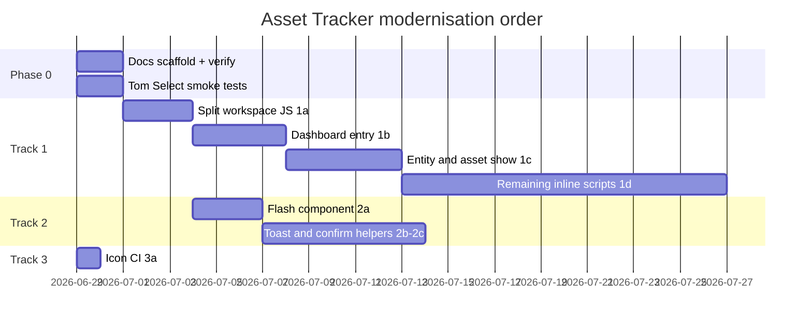

# Tech Update — Asset Tracker Frontend & UX Plan

**Created:** 2026-06-29  
**Audited against:** `master` workspace + comparison with Migration Manager CRM (`migrationmanager2/docs/TECH_UPDATE.md`)  
**Purpose:** Record current frontend state, gaps, and a phased plan for performance, consistency, and maintainability.

---

## Executive summary

Asset Tracker is already on a modern stack (Laravel 13, Vite 8, Tailwind 4, Alpine.js, Tom Select, Flatpickr, Tiptap, Lucide). There is **no legacy `public/js` tree**, no jQuery, no Font Awesome, and no copy-to-public vendor scripts.

The remaining work is **not** a migration from old libraries — it is **consolidation and splitting**:

| Area | Status |
|------|--------|
| Vite core pipeline | **Done** — single `@vite` in layout (`app.css`, `app.js`) |
| Tom Select | **Done** — npm + `<x-tom-select>` + `tomselect-init.js` |
| Flatpickr | **Done** — npm + `<x-date-input>` + `flatpickr-init.js` |
| Rich text | **Done** — Tiptap 3 with lazy load in `tiptap-init.js` |
| Icons (Blade) | **Done** — `technikermathe/blade-lucide-icons` (~200+ uses) |
| Vite page splitting | **Not started** — heavy JS loaded globally |
| Inline Blade scripts | **27 files** with `<script>` blocks |
| Flash / toast / confirm UX | **Ad hoc** — duplicated banners, `alert()`, native `confirm()` |
| Icon CI guardrails | **Partial** — `scripts/verify-lucide-icons.php` exists, not wired |
| Frontend docs | **Not started** |

This document is the source of truth for what remains and how to apply it.

---

## Current stack (as of audit)

| Tool | Version / location |
|------|-------------------|
| PHP | 8.3+ |
| Laravel | 13.x |
| Node | 22+ recommended (README still says 18+ — update in Phase 0) |
| Vite | 8.x (`vite.config.js`) |
| Laravel Vite plugin | 3.1.x |
| Tailwind CSS | 4.x via `@tailwindcss/vite` |
| Alpine.js | 3.15.x — bundled in `app.js` |
| Tom Select | 2.6.x — `resources/js/tomselect-init.js` |
| Flatpickr | 4.6.x — `resources/js/flatpickr-init.js` |
| Tiptap | 3.27.x — `resources/js/tiptap-init.js` (dynamic import) |
| Lucide (Blade) | `technikermathe/blade-lucide-icons` ^3.156 |
| Icons verify script | `scripts/verify-lucide-icons.php` |

**Vite inputs today** (`vite.config.js`):

- `resources/css/app.css`
- `resources/js/app.js`

**JS modules** (`resources/js/`):

| File | Lines (approx) | Loaded |
|------|----------------|--------|
| `app.js` | 93 | Every page |
| `tomselect-init.js` | 198 | Every page (via app.js) |
| `flatpickr-init.js` | 74 | Every page (via app.js) |
| `transaction-paid-by-validation.js` | small | Every page (via app.js) |
| `documents-workspace.js` | 690 | Every page — **only needed on entity/asset show** |
| `compliance-workspace.js` | 1046 | Every page — **only needed on entity/asset show** |
| `tiptap-init.js` | 373 | Lazy — only when `[data-rich-text]` present |

**Large Blade views with inline JS:**

| View | Lines (approx) | Inline `<script>` |
|------|----------------|-------------------|
| `business-entities/show.blade.php` | 1291 | 2 blocks |
| `dashboard.blade.php` | 965 | 1 block |
| `assets/show.blade.php` | 858 | 1 block |

**Layout** (`resources/views/layouts/app.blade.php`): single `@vite` call, `@stack('scripts')` for page pushes. No raw vendor `<script>` tags.

---

## Comparison with Migration Manager CRM

Migration Manager’s `TECH_UPDATE.md` targets a very different baseline (jQuery, Bootstrap, FA 5, copied `public/js`, TinyMCE, Select2). **Most of that plan does not apply here.**

| Migration Manager track | Apply to Asset Tracker? |
|-------------------------|-------------------------|
| Select2 → Tom Select | **No** — already complete |
| Font Awesome 6 + IconHelper | **No** — use Lucide; skip FA entirely |
| Bootstrap via Vite | **No** — Tailwind |
| `vendor-libs.js` + copy scripts | **No** — vendors already in Vite |
| TinyMCE / ApexCharts / signature_pad | **No** — not in stack |
| Vite layout/page entries | **Yes** — adapted below |
| toast / confirm helpers | **Yes** |
| Tom Select QA matrix | **Yes** — verification only |
| Icon infrastructure | **Partial** — CI + JS dynamic icons only |

---

## Track 1: Vite page splitting & script extraction

**Status:** Not started  
**Priority:** High — largest bundle-size and maintainability win

### Current pain points

- `documents-workspace.js` + `compliance-workspace.js` (~1,736 lines) ship on **every** authenticated page
- 27 Blade files contain inline `<script>` blocks (page logic mixed with markup)
- `dashboard.blade.php` (~965 lines) and entity/asset show views are monolithic
- No entry-point map documenting which JS runs where

### Plan

#### Phase 1a — Split workspace bundles

- [ ] Remove `import './documents-workspace.js'` and `import './compliance-workspace.js'` from `app.js`
- [ ] Register new Vite inputs in `vite.config.js`:
  - `resources/js/pages/documents-workspace.js` (re-export or move existing file)
  - `resources/js/pages/compliance-workspace.js`
- [ ] Load via `@vite` only on pages that include the workspace partials:
  - `business-entities/show.blade.php`
  - `assets/show.blade.php`
- [ ] Verify workspace init still runs (IIFE / `DOMContentLoaded` listeners)

#### Phase 1b — Dashboard entry

- [ ] Extract inline script from `dashboard.blade.php` → `resources/js/pages/dashboard.js`
- [ ] Add Vite input; `@vite` on dashboard view only
- [ ] Keep shared helpers (`reinitTomSelect`, etc.) on `window` from `app.js`

#### Phase 1c — Entity & asset show entries

- [ ] Extract inline scripts from `business-entities/show.blade.php` → `resources/js/pages/entity-show.js`
- [ ] Extract inline scripts from `assets/show.blade.php` → `resources/js/pages/asset-show.js`
- [ ] Co-load workspace entries + page entry on those views

#### Phase 1d — Remaining inline scripts (incremental)

Priority order by traffic/complexity:

| Blade file | Suggested entry |
|------------|-----------------|
| `emails/reply.blade.php` | `pages/email-reply.js` |
| `business-entities/create.blade.php`, `edit.blade.php` | `pages/entity-form.js` |
| `bank-accounts/partials/form-fields.blade.php` | `pages/bank-account-form.js` |
| `reminders/create.blade.php`, `reminders/index.blade.php` | `pages/reminders.js` |
| `entity-persons/create.blade.php`, `edit.blade.php` | `pages/entity-person-form.js` |
| `property-reports/asset-summary.blade.php` | `pages/asset-summary-report.js` |
| `partials/header-global-search-scripts.blade.php` | `components/global-search.js` (load in nav layout) |
| `components/google-address-input.blade.php` | keep push or small `components/google-address.js` |
| Remaining bank-account / transaction / tenant forms | group by feature |

- [ ] Each extraction: one Vite entry, remove corresponding inline `<script>` from Blade
- [ ] Document final mapping in `docs/FRONTEND.md` (Phase 0)

#### Phase 1e — Optional lazy Tiptap tightening

- [ ] Confirm `tiptap-init.js` is never pulled on pages without `[data-rich-text]` (already lazy — verify after splits)
- [ ] Consider separate Vite entry if email compose bundle grows further

---

## Track 2: UX helpers (flash, toast, confirm)

**Status:** Ad hoc  
**Priority:** Medium — apply alongside Track 1 page entries

### Current state

| Pattern | Count (approx) | Notes |
|---------|----------------|-------|
| Duplicated `session('success')` / `session('error')` blocks | **27 views** | Inconsistent Tailwind markup |
| Native `confirm()` | **~34** (excl. CLI) | Blade forms + workspace JS |
| `alert()` | **~86** | Mostly `documents-workspace.js`, `compliance-workspace.js`, `emails/reply.blade.php` |
| Alpine modal component | Exists | `<x-modal>` — not used for confirms |

### Plan

#### Phase 2a — Flash component

- [ ] Create `<x-flash-messages />` — handles `success`, `error`, `warning`, `info`
- [ ] Include once in `layouts/app.blade.php` (below nav or in main)
- [ ] Replace per-view flash blocks incrementally (27 files)
- [ ] Optional: auto-dismiss with Alpine after N seconds

#### Phase 2b — Toast helper (JS)

- [ ] Add `resources/js/notify.js`:
  - `showToast(message, type = 'info', options?)`
  - Tailwind-styled fixed toast (no new npm dependency initially)
- [ ] Export on `window.showToast` from `app.js`
- [ ] Migrate workspace JS `alert()` calls first (highest volume)

#### Phase 2c — Confirm helper (JS + Blade)

- [ ] Add `confirmAction(message, options?)` — returns `Promise<boolean>`
  - Implementation: Alpine-driven confirm modal (reuse `<x-modal>` pattern) or lightweight custom element
- [ ] Export on `window.confirmAction`
- [ ] Migrate high-traffic confirms first:

| Action | Location |
|--------|----------|
| Delete transaction | `entity-show.js`, `asset-show.js` |
| Delete document / checklist row | `documents-workspace.js` |
| Delete compliance row / category | `compliance-workspace.js` |
| Delete note | entity/asset show Blade → page JS |
| Delete invoice / reminder / contact | respective index/show views |

#### Phase 2d — Form confirm pattern (Blade)

- [ ] For simple delete forms, optional `<x-confirm-button>` or `data-confirm="..."` attribute handled by shared listener in `app.js`
- [ ] Retire inline `onsubmit="return confirm(...)"` over time

---

## Track 3: Icons — guardrails & dynamic JS

**Status:** Blade complete; tooling incomplete  
**Priority:** Low–medium

### Current state

- Lucide via `<x-lucide-*>` across views — no Font Awesome
- `scripts/verify-lucide-icons.php` checks: unknown icons, inline `<svg>`, bad `:class` on Lucide components
- Only `components/application-logo.blade.php` still has inline SVG (allowed exception)
- Workspace JS builds HTML strings — no Lucide in dynamic DOM today (text/icons minimal)

### Plan

#### Phase 3a — CI / npm wiring

- [ ] Add to `package.json`:
  ```json
  "verify:icons": "php scripts/verify-lucide-icons.php"
  ```
- [ ] Add pre-build or CI step: `php artisan icons:cache && npm run verify:icons`
- [ ] Extend `.github/workflows/` with a `frontend-checks` job (build + verify:icons) before deploy

#### Phase 3b — JS dynamic icons (when needed)

- [ ] If workspace UI adds icons in JS-generated HTML, prefer:
  1. Hidden `<template>` in Blade + `cloneNode`, or
  2. npm `lucide` package + small `renderIcon(name, class)` helper
- [ ] Do **not** introduce Font Awesome or a PHP `IconHelper` — stay on Blade Lucide + optional JS helper

#### Phase 3c — Ongoing

- [ ] Run `verify:icons` after adding new Lucide names
- [ ] Document icon conventions in `docs/FRONTEND.md`

---

## Track 4: Tom Select QA

**Status:** Implementation complete; formal QA pending  
**Priority:** Medium — run before Track 1 splits touch select-heavy pages

### Done

- `tom-select` npm package + `tomselect-init.js`
- `<x-tom-select>` Blade component with `data-tomselect-*` attributes
- `watchTomSelect()` for dynamically injected selects
- Global helpers: `reinitTomSelect`, `refreshTomSelect`, `rebuildTomSelectFromNative`, `setSelectValue`, `setSelectDisabled`

### Smoke test matrix

| Screen / feature | Verify |
|------------------|--------|
| Dashboard — add transaction modal | Entity/asset selects, paid-by select reinit |
| Dashboard — add reminder modal | Asset select disabled/enabled on entity change |
| Business entity show — bank link modal | `bank_account_id` reinit after open |
| Business entity show — account picker rows | Dynamic `data-tomselect` rows |
| Asset show — same bank/account patterns | As above |
| Entity create/edit — appointor toggles | Person vs entity select visibility + reinit |
| Entity person create/edit | Trustee + person selects |
| Bank account form — holder toggle | Entity vs person select |
| Reminders create | Asset options reload on entity change |
| Report entity scope picker | Disabled sync with Alpine scope |
| Emails index / reply | Business entity + asset selects |
| Tenant create | Real estate company select |
| Transactions index | Entity filter auto-submit |
| Chart of accounts create/edit | Parent account select |
| Any modal dropdown | Visible above modal (add `dropdownParent: document.body` if clipped) |

- [ ] Create `docs/TOMSELECT-QA.md` with checklist above
- [ ] Manual pass on staging; note any `dropdownParent` fixes needed
- [ ] Mark complete before merging Phase 1b (dashboard)

---

## Track 5: Documentation & tooling

**Status:** Not started  
**Priority:** Low — start in Phase 0, keep updated per phase

### Plan

- [ ] Create `docs/FRONTEND.md`:
  - Stack overview
  - Vite entry → screen mapping (updated as Track 1 progresses)
  - Conventions: `<x-tom-select>`, `<x-date-input>`, `<x-rich-text-editor>`, `<x-lucide-*>`
  - How to add a new page-specific JS entry
  - Notify / confirm helper API
- [ ] Update `README.md` Architecture section:
  - Node 22+
  - List Vite entries (once split)
  - Link to `docs/TECH_UPDATE.md` and `docs/FRONTEND.md`
- [ ] Optional: `npm run build:check` → `vite build && npm run verify:icons`

---

## Out of scope (this plan)

These are separate product/backend efforts — do not mix with frontend phases unless explicitly coordinated:

| Item | Notes |
|------|-------|
| Database / model renames | Independent migrations |
| New report types | Feature work |
| Gmail sync / Python bank import | Backend |
| S3 / encryption changes | Infrastructure |
| Migration Manager CRM parity | Different codebase — see comparison section |

---

## Recommended apply order



**Rationale:**

1. **Phase 0** — cheap guardrails (icon verify, QA doc) before touching bundles.
2. **Track 1a** — immediate win: stop shipping ~1,700 lines of workspace JS on list/dashboard/form pages.
3. **Track 2a flash component** — can run in parallel with 1b; reduces noise while editing views.
4. **Track 1b–1c** — tackle largest inline scripts next.
5. **Track 2b–2c** — migrate `alert`/`confirm` when extracting page JS (same PRs).
6. **Track 1d** — incremental; one feature area per PR.

---

## Pre-deploy checklist (each phase)

- [ ] `npm run build` succeeds
- [ ] `php artisan icons:cache && npm run verify:icons` passes (once wired)
- [ ] No new console errors on:
  - Dashboard (transaction + reminder modals)
  - Business entity show (all tabs: documents, compliance, transactions)
  - Asset show (same tabs)
  - Emails reply / upload
  - Bank account create/edit
- [ ] Tom Select dropdowns visible in modals
- [ ] Flatpickr dates on forms still open and submit correctly
- [ ] Rich text (Tiptap) on note/email templates still saves
- [ ] Smoke test with production build (`npm run build`, not `npm run dev`)

---

## PR sizing guide

| PR | Scope |
|----|-------|
| 1 | Phase 0: `docs/FRONTEND.md` stub, `verify:icons` script, CI job |
| 2 | Track 1a: workspace Vite split only |
| 3 | Track 2a: `<x-flash-messages />` + layout include |
| 4 | Track 1b: dashboard JS extraction |
| 5 | Track 2b–2c: notify.js + confirmAction + workspace alert migration |
| 6 | Track 1c: entity-show + asset-show extraction |
| 7+ | Track 1d: one feature area per PR |

One logical phase per PR where possible — easier rollback.

---

## Revision log

| Date | Change |
|------|--------|
| 2026-06-29 | Initial plan from workspace audit vs Migration Manager TECH_UPDATE.md |
